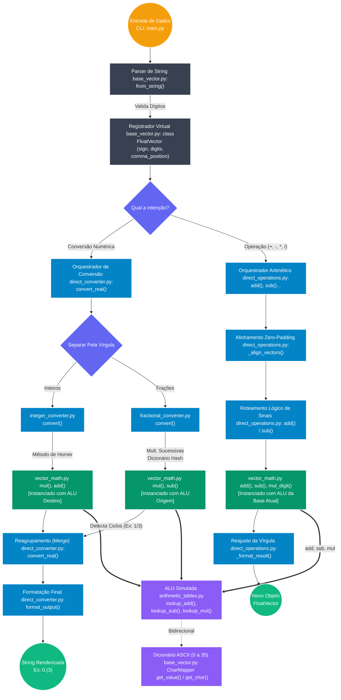

# Arquitetura do Sistema: Processador Aritmético Vetorial

Este diagrama Mermaid ilustra o *pipeline* de dados e a hierarquia de classes do projeto `direct-base-arithmetic`. A arquitetura foi construída sob os princípios **SOLID** (com foco no Princípio da Responsabilidade Única - SRP), garantindo um desacoplamento total entre o controle de fluxo (Facades) e a computação matemática bruta (Baixo Nível).

### Legenda da Arquitetura:
*   **Laranja (Entrada):** O Ponto de Entrada da aplicação (`main.py`).
*   **Cinza (Data Structures):** Nossas estruturas de armazenamento contínuo e *Parsers* (Ex: `FloatVector`).
*   **Azul (Facades de Alto Nível):** Classes orquestradoras. Elas lidam com a regra de negócio (Ponto Flutuante, preenchimento de zeros, sinais negativos) e protegem o usuário da matemática bruta.
*   **Roxo (Decisões):** Desvios de lógica algorítmica.
*   **Verde Escuro (Baixo Nível):** A classe `VectorMath` (`vector_math.py`), nosso "Coprocessador Matemático". Opera exclusivamente com matrizes puras, ignorando sinais e vírgulas.
*   **Violeta (Hardware Simulado):** As *Look-up Tables* em `arithmetic_tables.py`. Geram as matrizes $O(1)$ equivalentes aos circuitos combinacionais físicos de uma Unidade Lógica e Aritmética (ALU).
*   **Verde Claro (Saída):** O produto finalizado e validado após o processamento.
